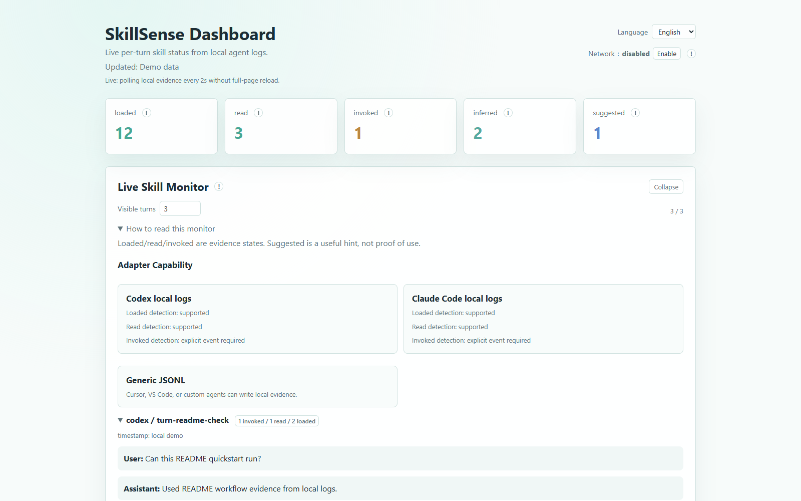
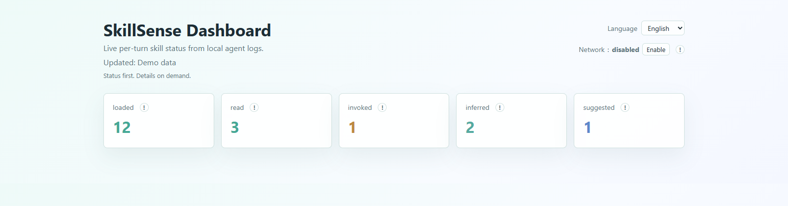

# SkillSense

**See what skills your AI coding agent actually used.**

AI coding agents are starting to rely on skills, rules, local instructions, and tool-specific workflows. That is great when everything works. It is maddening when a turn goes sideways and you are left asking the real question:

Did the agent actually use the thing I wrote for it?

SkillSense gives you a local receipt. It watches agent logs and turns them into a live evidence timeline, so you can see whether a skill was `loaded`, `read`, `invoked`, merely `suggested`, or `not detected`.

No cloud tracing is required. No API key is required. Your generated state stays under `.skillsense/`, which is ignored by Git.



## Why SkillSense Exists

Most agent misses are not dramatic. They are quiet.

A skill was available, but never read. A `SKILL.md` was opened, but no real invocation happened. Two skills overlapped and made the routing muddy. A better workflow existed, but the agent answered from the general context instead.

SkillSense is built for that moment. It does not try to be another agent. It sits beside the agent and shows the evidence you would otherwise have to dig out of local logs by hand.

## Try It In 60 Seconds

```bash
git clone https://github.com/LingYi-Liang/Skillsense.git
cd Skillsense
pip install -e .
skillsense scan
skillsense serve --interval 2
```

Then open:

```text
http://127.0.0.1:8765/dashboard.html
```

`127.0.0.1` is your own machine. The live dashboard is local by default and is not exposed to the internet.

## What You Get

| Surface | What it helps you see |
| --- | --- |
| Live monitor | Recent agent turns and the skill evidence attached to them. |
| Evidence timeline | Whether a skill was visible, read, invoked, inferred, suggested, or missing. |
| Local skill index | Project, Codex, Claude Code, and example skills found on this machine. |
| Intervention queue | Missed skills, broad descriptions, trigger overlap, and suspicious routing. |
| Generic adapter | Cursor, VS Code, or custom agents can feed JSONL evidence into the same view. |
| Language switcher | English, Chinese, Japanese, Korean, Spanish, and French dashboard copy. |



## Live Skill Monitor

`skillsense serve --interval 2` serves the dashboard at `http://127.0.0.1:8765/dashboard.html`. That address is localhost: it points to the machine running SkillSense, not to a public server.

The monitor is the main product surface. It shows recent turns, the evidence tied to those turns, and a folded `Trigger Diagnostics` area for each turn. Diagnostics use the local skill index and existing evidence only; they do not call an LLM.

Dashboard hierarchy:

| Layer | Dashboard area |
| --- | --- |
| Core | `Live Skill Monitor` |
| Review | `Evidence Timeline`, `Intervention Queue` |
| Supporting | `Suggested`, `Recommended`, `Project Conflicts` |
| Reference | `Local Skill Index` |
| Advanced | policy and privacy settings |

## Supported

| Area | Support |
| --- | --- |
| Runtime | Python 3.10+ |
| Package | `skillsense` |
| Built-in adapters | Codex local logs, Claude Code project logs, generic JSONL evidence |
| Dashboard languages | English, Chinese, Japanese, Korean, Spanish, French |
| Network use | Off by default; optional metadata enrichment only |
| Runtime dependencies | None |
| License | MIT |

## Accuracy Notice

Evidence, not vibes. SkillSense separates different levels of proof instead of pretending they are the same thing.

| State | Meaning |
| --- | --- |
| `loaded` | The platform made a skill visible to the agent. Useful, but still just availability. |
| `read` | Local logs show a `SKILL.md` file was opened. Stronger evidence than `loaded`. |
| `invoked` | The platform logged an explicit skill invocation event. This is the strongest signal. |
| `inferred` | SkillSense can only guess from traces such as commands, output, or file changes. |
| `suggested` | SkillSense thinks a skill may fit the prompt, but no usage evidence was found. |
| `not detected` | No local evidence was found. SkillSense leaves it unknown. |

If a platform does not expose real invocation logs, SkillSense will say so. It is better to show a weaker signal honestly than to make a confident claim from thin air.

## Privacy Model

Generated state lives in `.skillsense/`:

```text
.skillsense/skills_index.json
.skillsense/state.json
.skillsense/interventions.json
.skillsense/report.md
.skillsense/dashboard.html
.skillsense/config.json
.skillsense/metadata_cache.json
```

That folder is ignored by Git. It may contain local paths and generated reports, so do not manually upload it to GitHub.

Turn text is hidden by default:

```json
{
  "privacy": {
    "store_turn_text": false,
    "show_turn_text": false
  }
}
```

The dashboard can still show evidence without storing your chat text. Enable text storage only when you want local debugging details.

## CLI

```bash
skillsense scan
skillsense list
skillsense suggest "<user prompt>"
skillsense evidence
skillsense status
skillsense serve --interval 2
skillsense report
skillsense diagnose
```

<details>
<summary>More commands</summary>

```bash
skillsense watch --interval 2
skillsense reset-state
skillsense interventions
skillsense propose-fix <intervention-id>
skillsense apply-fix <intervention-id> --yes
skillsense dismiss <intervention-id>
skillsense why-not <skill-name> "<user prompt>"
skillsense rewrite-description <skill-name>
skillsense mute <skill-name>
skillsense unmute <skill-name>
skillsense prefer <skill-name>
skillsense unprefer <skill-name>
skillsense ask-before <skill-name>
skillsense no-ask-before <skill-name>
skillsense config get
skillsense config set language zh-CN
skillsense config set network.enabled true
skillsense config set network.enabled false
skillsense config set privacy.store_turn_text true
skillsense config set privacy.store_turn_text false
skillsense config set privacy.show_turn_text true
skillsense config set privacy.show_turn_text false
```

</details>

## Other Agent Platforms

Codex and Claude Code adapters read their local logs directly. Other tools can write newline-delimited JSON into:

```text
.skillsense/evidence/*.jsonl
```

Example:

```json
{"platform":"cursor","turn_id":"turn-1","timestamp":"2026-05-14T10:00:00Z","user_message":"check README","assistant_summary":"opened docs skill"}
{"platform":"cursor","turn_id":"turn-1","skill_name":"readme-runner","event_type":"read","certainty":"confirmed","source":"generic_jsonl","snippet":"SKILL.md opened"}
```

Use `invoked` only when the platform exposes a real invocation event. For schema details and Cursor, VS Code, or custom agent examples, see [docs/generic-evidence-adapter.md](docs/generic-evidence-adapter.md).

## Scan Locations

```text
./.claude/skills/
~/.claude/skills/
./.codex/skills/
~/.codex/skills/
./skills/
./examples/
```

`./examples/` is included so a fresh checkout can demonstrate `skillsense scan` immediately.

## Adapter Status

| Adapter | Status |
| --- | --- |
| Generic local scan and JSONL evidence | shipped |
| Codex session logs | shipped |
| Claude Code project logs | shipped |
| Cursor / VS Code sidebar | later |
| Platform-level blocking | later, only if a platform exposes the hook |

## The Short Version

If you are writing skills for agents, you need a way to tell the difference between "the agent had access to this" and "the agent actually used it."

That difference is the whole point of SkillSense.
